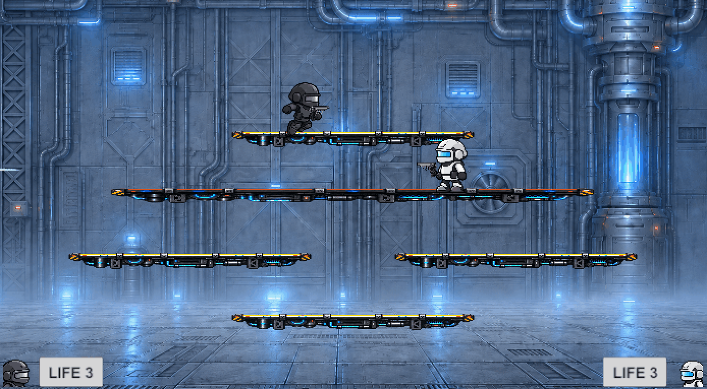

# Project Shooter

Unity로 제작한 2D 플랫폼 슈팅 게임입니다. 플레이어와 AI가 이동·점프·사격으로
상대를 밀어내며, 정해진 라이프를 먼저 모두 잃은 쪽이 패배합니다.

## 프로젝트 정보

| 항목 | 내용 |
| --- | --- |
| 개발 기간 | 2026.08.05 ~ 2026.09.04 |
| 개발 인원 | 1명 (개인 프로젝트) |
| 담당 범위 | 기획, 구현, 테스트 및 문서화 전반 |
| 활용 도구 | AI 코딩 에이전트 및 이미지 생성 도구 |

## Portfolio v1 범위

- 싱글 플레이어 대 AI 1:1 전투
- 맵 및 AI 난이도 선택이 가능한 게임 설정 화면
- 오브젝트 풀 기반 투사체와 질량을 반영한 넉백
- 추락 판정, 라이프 차감, 재생성 위치 선택, 재생성 보호막
- 경기 시작 카운트다운과 일시정지
- 경기 종료 후 재경기, 설정 변경, 메인 메뉴 이동
- EditMode 및 PlayMode 테스트

현재 v1은 `FactoryMap` 한 개와 기본 AI 난이도 한 개를 완성 범위로 삼습니다.
전투는 체력이나 대미지 수치 없이 넉백과 추락으로만 승패가 결정됩니다.

## 조작법

| 동작 | 키보드 |
| --- | --- |
| 이동 | 방향키 좌우 |
| 점프 | 방향키 위 |
| 플랫폼 내려가기 | 방향키 아래 |
| 공격 | `Z` |
| 일시정지 / 재개 | `Esc` |

## 설계 방향

- **공통 명령 처리**: 사람의 입력과 AI의 판단 결과를 같은 명령 형태로 전달하여,
  이동·점프·공격 로직이 조작 주체와 무관하게 동작하도록 구성했습니다.
- **데이터 기반 게임 설정**: 맵과 AI 난이도를 코드에 고정하지 않고 데이터와
  카탈로그로 관리합니다. 설정 화면의 선택 결과는 전투 씬으로 전달됩니다.
- **투사체 오브젝트 풀링**: 반복적으로 발사되는 투사체를 생성·삭제하는 대신
  재사용하여 전투 중 불필요한 객체 할당을 줄였습니다.
- **경기 상태 중심의 흐름 관리**: 대기, 카운트다운, 진행, 종료 상태를 기준으로
  참가자 입력과 UI, 재경기 흐름이 일관되게 전환되도록 설계했습니다.
- **씬 구성 검증**: 전투 시작 시 참가자, 스폰 지점, HUD 등 필수 요소의 연결을
  확인하여 씬 설정 누락을 조기에 발견할 수 있도록 했습니다.
- **자동화된 검증**: 런타임 코드와 테스트 어셈블리를 분리하고, 데이터·프리팹
  구성을 확인하는 EditMode 테스트와 실제 게임 흐름을 확인하는 PlayMode 테스트
  총 69개를 구성했습니다.

## 실행 환경

- Unity `6000.3.11f1`
- Input System `1.19.0`
- Universal Render Pipeline `17.3.0`

프로젝트를 Unity에서 연 뒤 `Assets/Scenes/MainMenu.unity`를 열어 Play하면 전체
흐름을 확인할 수 있습니다. 실행 파일을 만들 때도 Main Menu가 첫 씬으로 설정되어
있습니다.

## 빌드

Unity 메뉴의 `Project Shooter > Build`에서 릴리스 빌드를 생성할 수 있습니다.

- `Build Windows`: `Builds/Windows`에 1280×720 고정 창 모드의 Windows 64-bit
  빌드를 생성합니다.
- `Build Web`: `Builds/Web`에 960×540 크기의 16:9 Web 빌드를 생성합니다.
- `Build Windows and Web`: 두 플랫폼을 순서대로 빌드합니다.

빌드 메뉴는 Main Menu, Game Setup, Factory Map 세 씬만 포함하며 테스트 씬은
제외합니다. Web 빌드는 Gzip 압축과 Decompression Fallback을 사용하도록 자동
설정되어 정적 웹 호스팅에서도 실행할 수 있습니다.

## 테스트

Unity Test Runner에서 다음 테스트 어셈블리를 각각 실행합니다.

- `ProjectShooter.EditModeTests`
- `ProjectShooter.PlayModeTests`

PlayMode 테스트가 사용하는 `Assets/Scenes/Testing/TestScene.unity`는 공용 테스트
픽스처이며 실제 게임 진행에서는 노출되지 않습니다.
